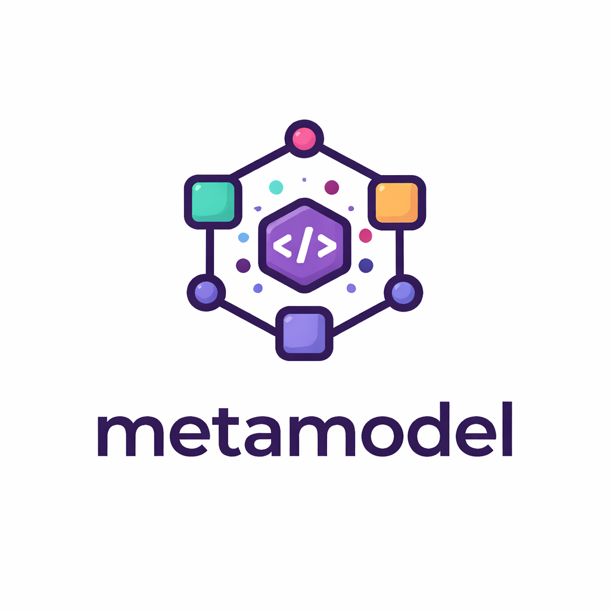

# metamodel



An exploration of meta-modeling in Elixir.

---

## Intent

**metamodel** explores how to represent models, meta-models, and transformations between them using plain Elixir data structures.

The goal is to build systems that are:

- composable
- introspectable
- data-driven

---

## Why

Elixir already provides powerful tools:

- structs
- typespecs
- Ecto schemas

But these operate mostly at a single level of abstraction.

This project explores multiple levels:

| Level       | Example                  |
|------------|--------------------------|
| Meta-model | "A model has fields"     |
| Model      | `User(name: string)`     |
| Data       | `%{name: "Bruno"}`      |

---

## Core Idea

> A model is data. A meta-model is also data.

Instead of relying heavily on macros and DSLs, we represent everything as data:

```elixir
%MetaModel{
  name: :entity,
  fields: [
    {:name, :string},
    {:age, :integer}
  ]
}
```

---

## Usage

Define a schema module with `use MetaDsl`, then declare your base type and derive
as many specialised types as you need:

```elixir
defmodule MyApp.Schema do
  use MetaDsl

  meta_type :user do
    property :id,            :uuid,     required: true
    property :name,          :string,   required: true
    property :email,         :string,   required: true
    property :password_hash, :string,   required: true
    property :role,          :string,   required: true
    property :inserted_at,   :datetime, required: true
  end

  # CRUD input shapes
  subtype :create_user, from: :user, except: [:id, :inserted_at]
  subtype :update_user, from: :user, only:   [:id, :name, :email]
  subtype :delete_user, from: :user, only:   [:id]

  # API response shapes
  subtype :public_user,  from: :user, only:   [:id, :name]
  subtype :session_user, from: :user, except: [:password_hash]

  # Role extension
  extend_type :admin_user, from: :user do
    property :permissions, {:list, :string}, required: true
  end

  # Domain events
  extend_type :user_created_event, from: :user do
    property :occurred_at, :datetime, required: true
  end

  subtype :user_deleted_event, from: :user, only: [:id]
end
```

Query the resolved types at runtime:

```elixir
# All registered types (sorted by name)
MyApp.Schema.meta_types()

# A single type struct
MyApp.Schema.meta_type(:admin_user)
#=> %MetaDsl.MetaType{name: :admin_user, derived_from: %MetaDsl.Derivation{kind: :extend, from: :user}, ...}

# Properties of a derived type
MyApp.Schema.properties(:session_user) |> Enum.map(& &1.name)
#=> [:id, :name, :email, :role, :inserted_at]

# Run a generator on the full schema
{:ok, output} = MetaDsl.Generators.Debug.generate(MyApp.Schema.meta_types())
IO.puts(output)
```

### Derivation kinds

| Macro | `:derived_from` kind | Description |
|---|---|---|
| `subtype …, only: [...]` | `:project` | Keep only the listed properties |
| `subtype …, except: [...]` | `:project` | Drop the listed properties |
| `extend_type … do … end` | `:extend` | Inherit all properties and append new ones |

---

## Design Principles

### Multi-level modeling

Explicit separation between:

- meta (definitions)
- model (structure)
- data (instances)

### Composability

Models should be easy to merge, extend, and transform.

---

## License

This is free and unencumbered software released into the public domain.

Anyone is free to copy, modify, publish, use, compile, sell, or distribute this software, either in source code form or as a compiled binary, for any purpose, commercial or non-commercial, and by any means.

In jurisdictions that recognize copyright laws, the author or authors of this software dedicate any and all copyright interest in the software to the public domain. We make this dedication for the benefit of the public at large and to the detriment of our heirs and successors. We intend this dedication to be an overt act of relinquishment in perpetuity of all present and future rights to this software under copyright law.

THE SOFTWARE IS PROVIDED "AS IS", WITHOUT WARRANTY OF ANY KIND, EXPRESS OR IMPLIED, INCLUDING BUT NOT LIMITED TO THE WARRANTIES OF MERCHANTABILITY, FITNESS FOR A PARTICULAR PURPOSE AND NONINFRINGEMENT. IN NO EVENT SHALL THE AUTHORS BE LIABLE FOR ANY CLAIM, DAMAGES OR OTHER LIABILITY, WHETHER IN AN ACTION OF CONTRACT, TORT OR OTHERWISE, ARISING FROM, OUT OF OR IN CONNECTION WITH THE SOFTWARE OR THE USE OR OTHER DEALINGS IN THE SOFTWARE.

For more information, please refer to <https://unlicense.org/>

